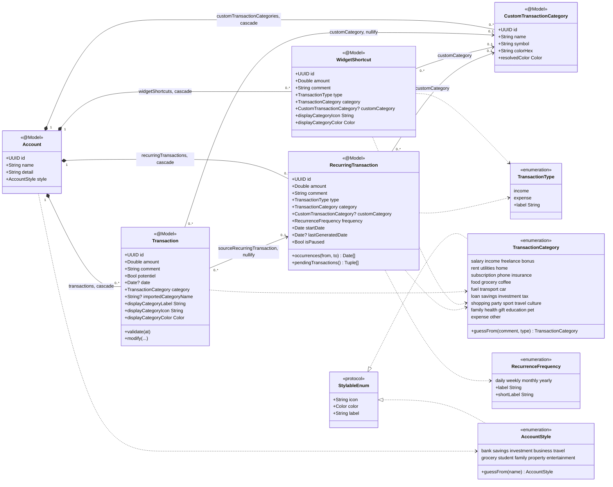
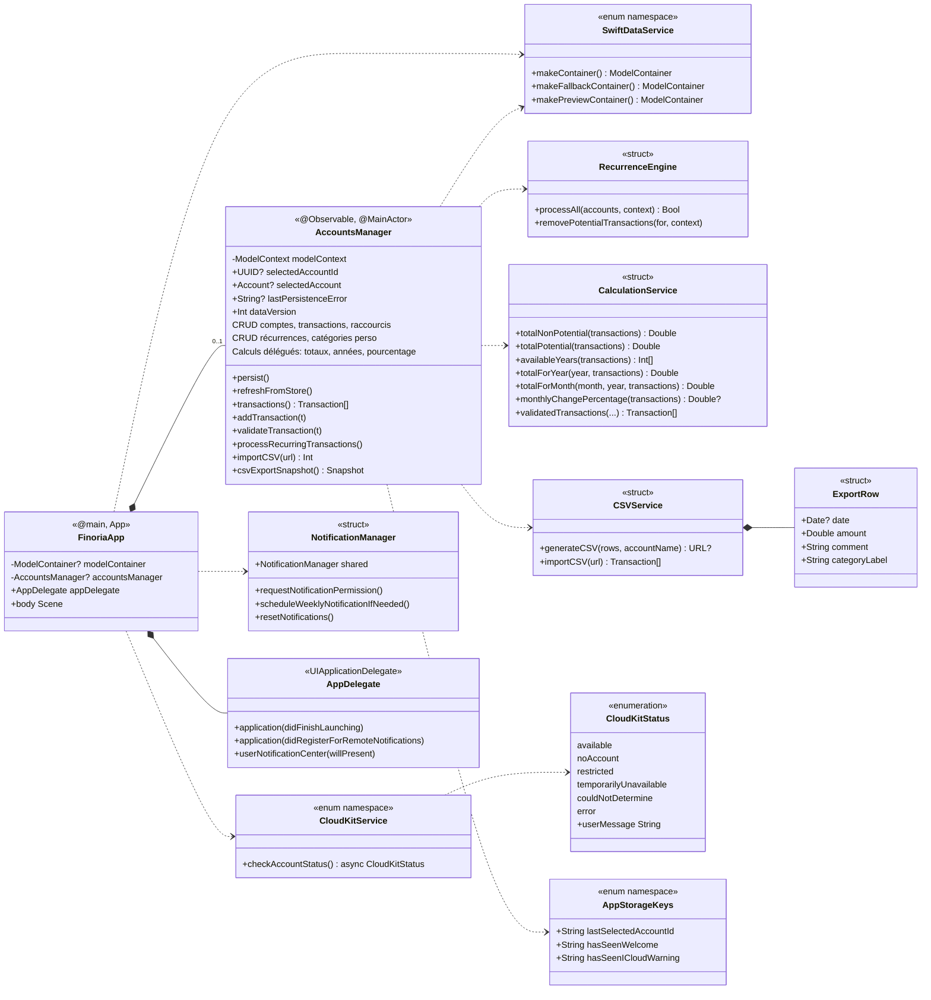
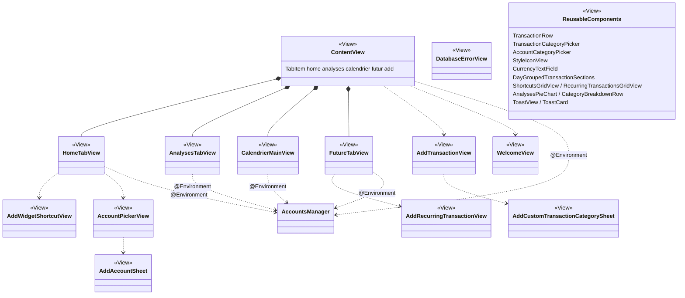

# Finoria — Diagramme de classes

Vue d'ensemble des classes de l'application (modèles, orchestrateur, services, vues).

> Rendu automatiquement par GitHub. Pour modifier, éditer les blocs `mermaid` ci-dessous.
> Une version PlantUML équivalente existe dans [CLASS_DIAGRAM.puml](CLASS_DIAGRAM.puml).

## 1. Modèle de données (SwiftData) & enums

## 2. Orchestration & services

## 3. Hiérarchie des vues (SwiftUI)

## Légende

| Notation | Signification |
|---|---|
| `*--` | Composition (cycle de vie lié — suppression en `cascade`) |
| `-->` | Association (lien `nullify`, l'objet survit) |
| `..>` | Dépendance / usage (délégation, injection `@Environment`) |
| `..\|>` | Réalisation d'un protocole |
| `"1" … "0..*"` | Multiplicités (1, 0..1, 0..*) |
| `<<@Model>>` | Entité persistée SwiftData |
| `<<View>>` | Vue SwiftUI |
