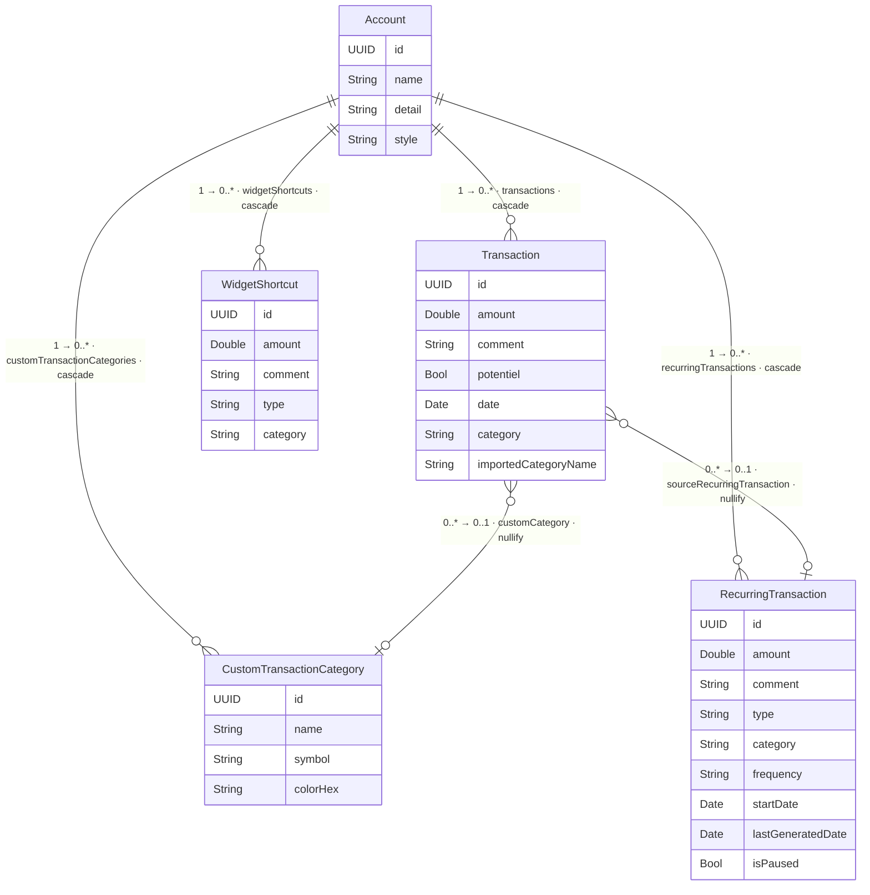

# Finoria — Data Model

Schéma des entités SwiftData et de leurs relations.

> Rendu automatiquement par GitHub. Pour modifier, éditer le bloc `mermaid` ci-dessous.

> **Cardinalités** — Mermaid impose la notation « patte d'oie » sur le trait
> (`||` = exactement 1, `o{` = 0..*, `o|` = 0..1). Les multiplicités numériques
> demandées (`1`, `0..*`, `0..1`) sont donc reportées en début de libellé de chaque
> relation. Le diagramme de classes ([CLASS_DIAGRAM.puml](CLASS_DIAGRAM.puml), PlantUML)
> les exprime nativement (`"1" o-- "0..*"`).

## Règles de suppression

| Relation | Règle | Conséquence |
|---|---|---|
| `Account → Transaction` | cascade | Supprimer un compte supprime toutes ses transactions |
| `Account → WidgetShortcut` | cascade | Supprimer un compte supprime tous ses raccourcis |
| `Account → RecurringTransaction` | cascade | Supprimer un compte supprime toutes ses récurrences |
| `Account → CustomTransactionCategory` | cascade | Supprimer un compte supprime toutes ses catégories perso |
| `CustomTransactionCategory → Transaction` | nullify | Supprimer une catégorie met `customCategory = nil` sur les transactions (elles sont conservées) |
| `RecurringTransaction → Transaction` | nullify | Supprimer une récurrence conserve les transactions déjà générées (historique) |

## Stockage

| Données | Où | Synchronisation |
|---|---|---|
| Comptes, transactions, raccourcis, récurrences, catégories | SQLite via SwiftData | CloudKit (iCloud) automatique |
| Compte sélectionné | `UserDefaults` | Non synchronisé — préférence locale |

## Versionnage du schéma & migration (zéro perte de données)

Le schéma est **versionné** pour pouvoir faire évoluer la structure des données lors
d'une mise à jour **sans jamais perdre une donnée utilisateur** (ni sur l'appareil, ni
dans iCloud). Tout est centralisé dans
[`Finoria-app/Models/FinoriaSchema.swift`](Finoria-app/Models/FinoriaSchema.swift) :

| Élément | Rôle |
|---|---|
| `FinoriaSchemaV1` | Instantané figé de la structure actuelle (version `1.0.0`). **Ne jamais le modifier une fois publié.** |
| `FinoriaMigrationPlan` | Liste ordonnée des versions + étapes de migration entre elles |
| `FinoriaCurrentSchema` | Alias vers la dernière version ; lu par `SwiftDataService` pour construire le `ModelContainer` (la seule ligne à changer pour activer une nouvelle version) |

**Procédure pour changer la structure (résumé) :**

1. Ne pas toucher au `FinoriaSchemaVx` déjà publié.
2. Créer `FinoriaSchemaV2` (copie de V1 + le changement).
3. Ajouter l'étape de migration dans `FinoriaMigrationPlan.stages` :
   - **Additif** (nouvelle propriété avec valeur par défaut, nouveau `@Model`, relation optionnelle) → `.lightweight(fromVersion:toVersion:)` (automatique, compatible CloudKit).
   - **Complexe** (renommage, fusion, transformation) → `.custom(...)` avec `willMigrate`/`didMigrate` qui recopie l'ancienne donnée vers la nouvelle **avant** disparition de l'ancienne.
4. Faire pointer `FinoriaCurrentSchema` vers la nouvelle version.
5. Tester la migration sur un appareil contenant des données de l'ancienne version **avant** publication.

> ⚠️ **CloudKit n'accepte que les évolutions additives** : on ne supprime/renomme jamais
> un champ côté serveur. Pour « renommer », on ajoute le nouveau champ, on migre la donnée
> et on garde l'ancien (déprécié). La procédure complète et un modèle de V2 prêt à copier
> figurent dans l'en-tête de `FinoriaSchema.swift`.
