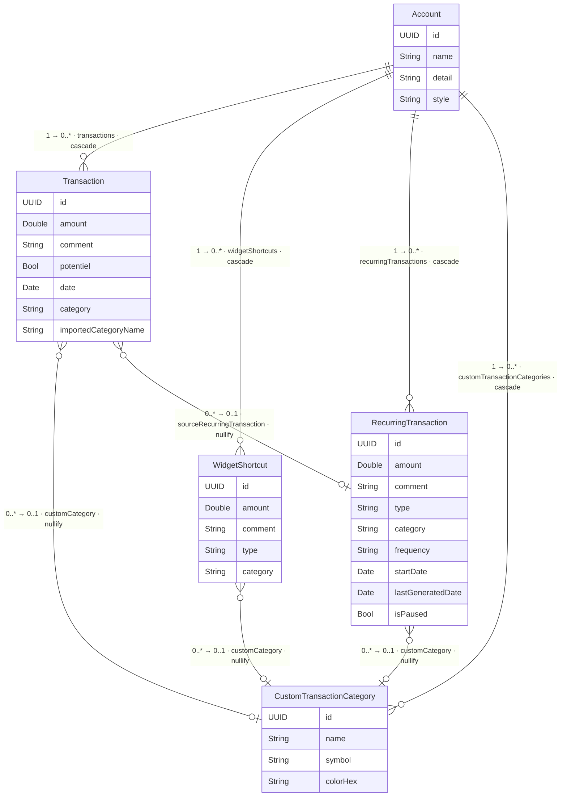

# Finoria — Data Model

Schéma des entités SwiftData et de leurs relations.

> Rendu automatiquement par GitHub. Pour modifier, éditer le bloc `mermaid` ci-dessous.

> **Inverses explicites** — `CustomTransactionCategory` déclare ses trois collections
> inverses (`transactions`, `widgetShortcuts`, `recurringTransactions`), toutes en
> `deleteRule: .nullify`. Supprimer une catégorie perso met donc `customCategory = nil`
> sur les transactions, raccourcis et récurrences qui la référençaient, de façon
> **garantie** (plus aucun inverse synthétisé implicitement). C'est un changement
> additif, appliqué par migration automatique (voir la section migration ci-dessous).

> **Cardinalités** — Mermaid impose la notation « patte d'oie » sur le trait
> (`||` = exactement 1, `o{` = 0..*, `o|` = 0..1). Les multiplicités numériques
> demandées (`1`, `0..*`, `0..1`) sont donc reportées en début de libellé de chaque
> relation. Le diagramme de classes ([CLASS_DIAGRAM.puml](CLASS_DIAGRAM.puml), PlantUML)
> les exprime nativement (`"1" o-- "0..*"`).

## Règles de suppression

| Relation | Règle | Conséquence |
|---|---|---|
| `Account → Transaction` | cascade | Supprimer un compte supprime toutes ses transactions |
| `Account → WidgetShortcut` | cascade | Supprimer un compte supprime tous ses raccourcis |
| `Account → RecurringTransaction` | cascade | Supprimer un compte supprime toutes ses récurrences |
| `Account → CustomTransactionCategory` | cascade | Supprimer un compte supprime toutes ses catégories perso |
| `CustomTransactionCategory → Transaction` | nullify | Supprimer une catégorie met `customCategory = nil` sur les transactions (elles sont conservées) |
| `CustomTransactionCategory → WidgetShortcut` / `RecurringTransaction` | nullify (inverse explicite) | Idem pour les raccourcis et récurrences qui pointaient sur la catégorie |
| `RecurringTransaction → Transaction` | nullify | Supprimer une récurrence conserve les transactions déjà générées (historique) |

## Stockage

| Données | Où | Synchronisation |
|---|---|---|
| Comptes, transactions, raccourcis, récurrences, catégories | SQLite via SwiftData | CloudKit (iCloud) automatique |
| Compte sélectionné | `UserDefaults` | Non synchronisé — préférence locale |

## Versionnage du schéma & migration (zéro perte de données)

Le schéma est **versionné** pour pouvoir faire évoluer la structure des données lors
d'une mise à jour **sans jamais perdre une donnée utilisateur** (ni sur l'appareil, ni
dans iCloud). Tout est centralisé dans
[`Finoria-app/Models/FinoriaSchema.swift`](Finoria-app/Models/FinoriaSchema.swift) :

| Élément | Rôle |
|---|---|
| `FinoriaSchemaV1` | Schéma **courant** (version `1.0.0`). Fige la composition des modèles. |
| `FinoriaMigrationPlan` | Liste des versions (`[V1]`) + étapes de migration. **`stages` est volontairement VIDE.** |
| `FinoriaCurrentSchema` | Alias vers la version courante (`V1`) ; lu par `SwiftDataService` pour construire le `ModelContainer`. |

> ⚠️ **`stages` doit rester VIDE tant que les `VersionedSchema` partagent les mêmes
> types `@Model`.** Comme `FinoriaSchemaVx.models` référence les vrais types vivants
> (`Account`, `Transaction`…), deux versions produisent un schéma au **checksum
> identique**. Ajouter une `MigrationStage.lightweight(V1 → V2)` entre deux schémas
> identiques **fait crasher l'app au lancement** (`NSLightweightMigrationStage` lève une
> NSException non rattrapable → abort). Pour les changements **additifs**, on ne crée
> donc NI nouvelle version NI étape : SwiftData applique une **migration légère
> automatique** qui suffit. (Régression réellement survenue sur le build 286, corrigée.)

**Procédure pour un changement ADDITIF (le cas courant — nouvelle propriété avec défaut,
nouveau `@Model`, nouvelle relation/inverse optionnel) :**

1. Éditer directement les `@Model` concernés.
2. **Ne pas** créer de nouvelle version, **ne pas** toucher à `stages` (rester vide).
3. SwiftData migre automatiquement le store existant, sans perte.
4. Tester sur un appareil contenant des données de la version précédente **avant** publication.

**Pour un changement COMPLEXE (renommer / fusionner / transformer)** — rare et à éviter :
il faut une vraie migration par étapes, ce qui impose d'abord de **figer une copie des
modèles par version** (types imbriqués dans chaque `enum VersionedSchema`, et non les
types partagés actuels), sinon checksums identiques → crash. Voir l'en-tête détaillé de
`FinoriaSchema.swift`.

> ⚠️ **CloudKit n'accepte que les évolutions additives** : on ne supprime/renomme jamais
> un champ côté serveur. Pour « renommer », on ajoute le nouveau champ, on migre la donnée
> et on garde l'ancien (déprécié).

> ℹ️ **Inverses `customCategory` explicites** — `CustomTransactionCategory` déclare
> désormais explicitement `widgetShortcuts` / `recurringTransactions` (au lieu d'inverses
> synthétisés). C'est un changement **additif**, appliqué par migration automatique (pas
> d'étape, pas de bump de version).

## Pièges à connaître pour faire évoluer la structure

Au-delà de la migration `@Model` automatique, ces points ne sont **pas** couverts par
le plan de migration et peuvent corrompre des données déjà publiées s'ils sont ignorés :

0. **Ne JAMAIS ajouter une `MigrationStage` entre des versions à types `@Model` partagés**
   (voir l'encadré ci-dessus) — crash garanti au lancement. Les changements additifs se
   font sans étape ; les changements complexes exigent d'abord des modèles figés par version.

1. **Stabilité des `rawValue` d'enum** — `category` (`TransactionCategory`),
   `style` (`AccountStyle`), `type` (`TransactionType`) et `frequency`
   (`RecurrenceFrequency`) sont persistés par leur `rawValue` (le nom du `case`).
   On peut **ajouter** des cas sans risque (additif). Mais **renommer ou supprimer** un
   `case` change/casse son `rawValue` : les enregistrements existants qui le contenaient
   ne se décodent plus. Pour renommer un libellé visible, modifier `label`, **jamais** le
   `case` lui-même. Pour retirer une catégorie, la garder dans l'enum (éventuellement
   masquée de `allCases`) plutôt que de supprimer le `case`.

2. **Identifiants iCloud figés** — le container CloudKit
   (`iCloud.com.godefroyinformatique.GDF-app`) et le bundle identifier ne doivent
   **jamais** changer après publication : toutes les données iCloud des utilisateurs y
   sont rattachées. Le nom interne historique (`GDF-app`) est sans importance, ne pas
   chercher à le « nettoyer ».

3. **Inverses de relation explicites (robustesse)** — ✅ Fait :
   `CustomTransactionCategory` déclare désormais explicitement `widgetShortcuts` et
   `recurringTransactions` (`deleteRule: .nullify`), au lieu de s'appuyer sur l'inverse
   synthétisé par SwiftData. Le comportement de suppression est garanti et lisible
   (changement additif, migré automatiquement — sans nouvelle version ni étape). À
   garder comme exemple de référence pour toute future relation : **toujours déclarer
   l'inverse explicitement.**
